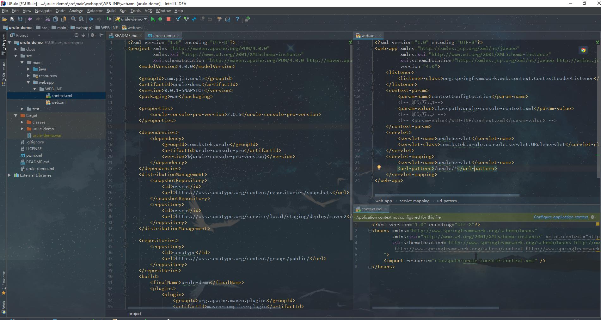
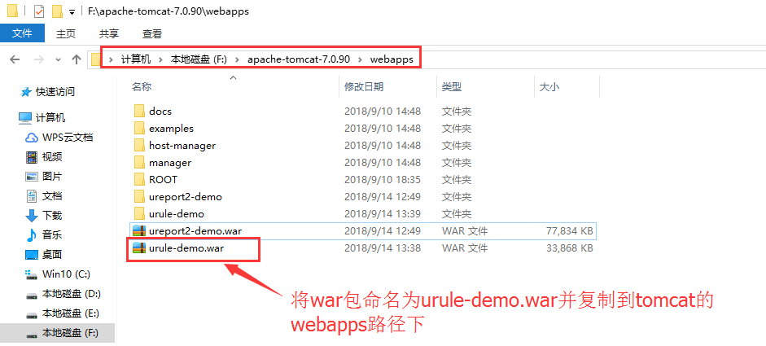
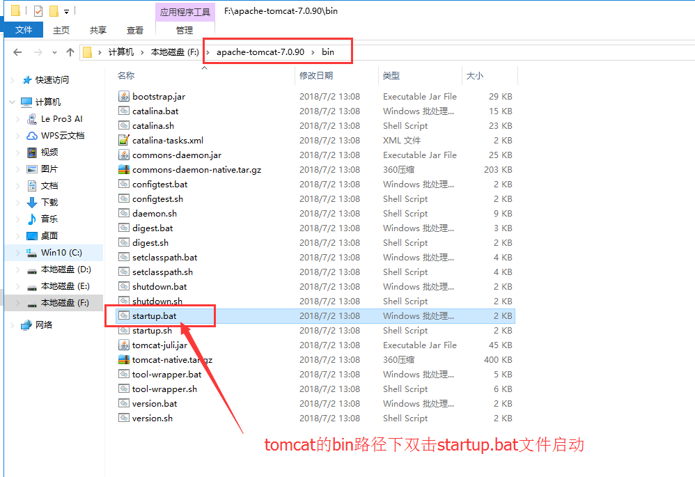
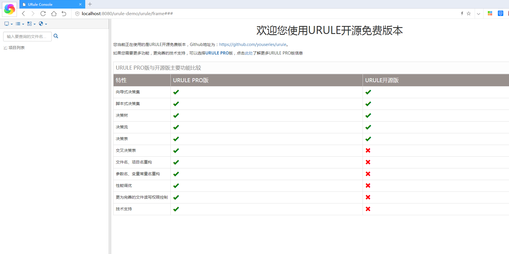

# urule-demo
a demo for urule

> URule是一款基于RETE算法纯Java的规则引擎产品。URule有两个不同版本：一个是基于Apache-2.0 License的开源版本；另一个是需要购买授权的PRO版本；URule PRO版完全兼容开源版本做出来的各种类型的规则文件。

> 在URule当中提供了向导式规则集、脚本式规则集、决策表、交叉决策表(PRO版)、决策树、评分卡及决策流共七种类型的规则定义方式，配合基于WEB的设计器，可快速实现规则的定义、维护与发布。

> 点击http://www.bstek.com了解更多关于URule PRO版信息；URule开源版本采用Apache-2.0开源协议，Github地址为：https://github.com/youseries/urule，欢迎前去fork、star。

# demo项目创建
> 参考教程http://wiki.bsdn.org/display/urule2/urule2+Home

# tomcat部署
> 打包过程在此不讲，有兴趣或疑问请自行检索检查
> 将war包命名为urule-demo.war并复制到tomcat的webapps路径下

> tomcat的bin路径下双击startup.up文件启动项目

> 启动tomcat之后在浏览器地址栏中输入urule的访问地址
http://localhost:8080/urule-demo/urule/frame

